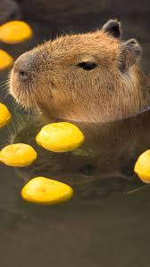

Так как данная статья подразумевает описание семи дней, то и рассказывать я буду также о субботе и воскресенье. Что ж, приятного чтения!

  
## Суббота и воскресенье 

Уже традиционно рассмотрим эти два дня вместе.

Ну что ж, суббота ознаменовалась работой над лабараторной, уже такой рутинной, что аж тошнит. В общем, задания были не интересные, повторяющие первый семестр и ещё надо было писать этот самый отчет... Было тяжко, но я справился.
На это можно просто крикнуть: "Ура" - и пойти дальше. А дальше был мажор, полуфиналы, этот турнир уже меня расстороил вылетом моей самой любимой команды, ожидая читаемой победы FaZe над моей самой ненавистной командой ублюдков и переоценного снайпера, я спокойно занимался своими делами, совершенно не парясь. Далее шел матч моего любимого игрока, точнее одного из самых любимых, Илюшки M0nesy, его команда проиграла, что немного огорчило, но узнал я о поражении уже утром, ведь досмотреть матч не было сил. Также под конец дня появился неплохой заказ, о котором я здесь не расскажу польностью, могу сказать только, что работал я мало, а получил много, хех

В воскресенье был финал мажора, я играл в кс, собственно так день и прошел, ничего примечательного. Разве что заказик был выполнен и ощущения, что вот я отдохнул, не было. 

## Понедельник

Понедельник - день тяжелый, но не у меня и не в этот понедельник)

Начался он с внезапно отмененной паре по программированию, видимо, первоапрельская шутка. Затем я почилил с чистой душой, ощущая, что работал вчера не зря, и отправился на прогулку по центру Москвы с одной замечательной девушкой, имени говорить не будем, да и не надо, кто знает, тот поймет. В этот день я заболел, сходил по пути до дома за сахаром и страдал весь оставшийся день. 

## Вторник

Вторник - продуктивный день, проснулся я в полседьмого, чтобы осуществить давнюю задумку начать бегать по утрам, что ж, пробежав с другом честный круг вокруг пруда в моем районе, получил неимоверное удовольствие от утренней шаурмы и воды после бега, но страдал из-за плохого самочуствия, поэтому планы с бегом пришлось затем отложить.

В середине дня я поехал на физкультуру, где перед началом занятия обыграл людей, которые играли там в настольрный теннис, хех, думаю, вообще попробоваться в сборную универа. Так, уставши ещё до физры, я получил неимоверное удовольствия от состояния овоща при игре в волейбол и поехал домой, где продолжал страдать, готовясь к предстояшим контрольным.

## Среда

Написав контрольные в состоянии амебы, кстати, вполне неплохо, и просидев матан с компалом, я направился домой с некоторыми переживаниями в голове по поводу подруги, с которой гулял в понедельник, но, как обычно это происходит, раздул из мухи слона, хоть это и испортило мне следующие два дня.

## Четверг

В этот день я был в том же состоянии, что и в октябре и начале ноября, бесконечные нервы, беспричинные и беспощадные. Это был второй раз, когда я испытываю что-то такое и первый, когда я смог с этим справиться. В общем, денб прошел в раздумьях, в мыслях, но не в реальности. Пары прошли, узнал я много чего, лицезрел то, как староста отдувается за не польностью заполненный журнал, надеюсь, меня такое не ждет. Вот и все. 

## Пятница

Самый легкий и трудный день одновременно, на первую пару я не пошел, потому что надо было в поликлинику, а придя домой, я устроил себе единственное,что мне могло помочь сейчас: полнейшее овощное состояние, чтоб вы понимали, дело в том, что я просто загонялся из-за того, что изначально неправильно понял. Потом переосознав кое-какие слова, я не перестал загоняться, это был эффект бабочки, ну, или же домино, который не хотел останавливаться и вводил меня в колесо Сансары, приводящий к одному и тому же.

А я просто взял кс, играл и ни о чем не думал, потом со споконой душой лег спать в три часа ночи, послушав музыку. 

## Выводы

Иногда слова трудно понять в их истинном значении, возможно кто-то из знакомых может вам помочь или же сам автор слов. 

Не загоняйтесь, так будет только хуже.
