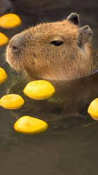

В этот раз я не буду описывать каждый день по отдельности, а скажу вкратце по неделе вообще.

Во-первых, моя работа в качестве, возможно, будущего председа НСВО двинулась, я поучаствовал в мегрофле, немного кринжовом, но пох, похнакомился с некоторыми старщаками и был этому рад.

Во-вторых, просидел с нашей командой в школе кураторов, по сути, я вкинул только одну идею, но это уже неплохо. В таком формате у меня никогда не получалось хорошо работать.

В-третьих, немного сблизился с девочками из нащей группы, с которыми раньше очень мало общался, это я сделал, чтобы не общать с Аней и быть при этом довольным собой и в гармонии с собой. 
В прошлый раз я рассказывал про то, как гулял с Анной Светцовой, питал какие-то надежды, но увы и ах, всё оказалось так, как я и подумал изначально, так что сейчас я с ней не общаюсь, да и ладно.

В-четвертых, говоря про школу кураторов, нельзя не упоминуть, что и там я кое с кем познакомился.

В-пятых, окончательно подтвердилось, что я остаюсь на две недели один дома, это меня радует. Новые обязанности, больше свободы, но на пары ходить надо, ведь я староста, подписи кроме меня никто не соберет.\

В-шестых, я начал вести дневник, прадва раз через раз, но всё же. Пишу туда свои мысли и переживания. 

В общем, неделя была интересной, дальше будет только лучше, я, кажется, уже почти закончил поиски того, чего мне не хватает, а пока...

Всем добра и позитива!

  

